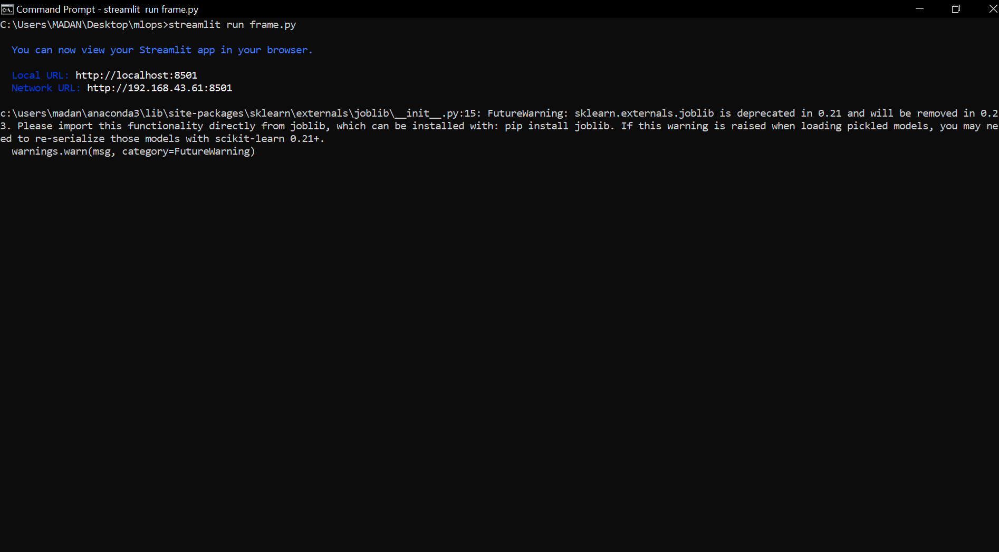
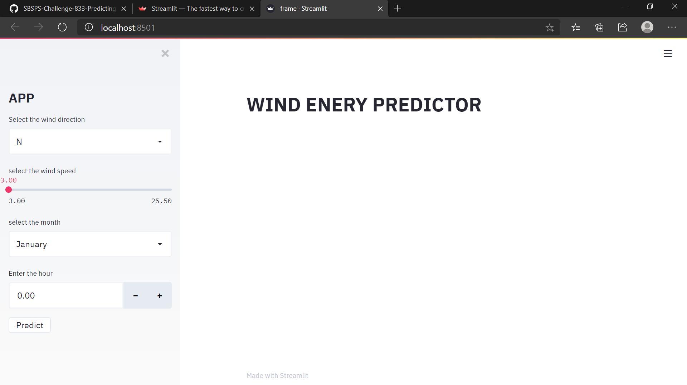
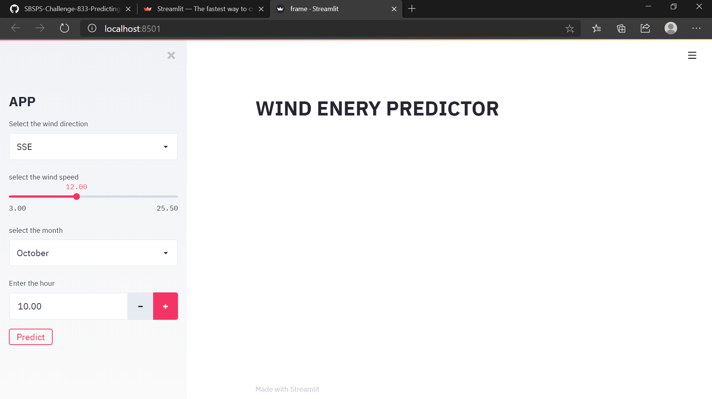
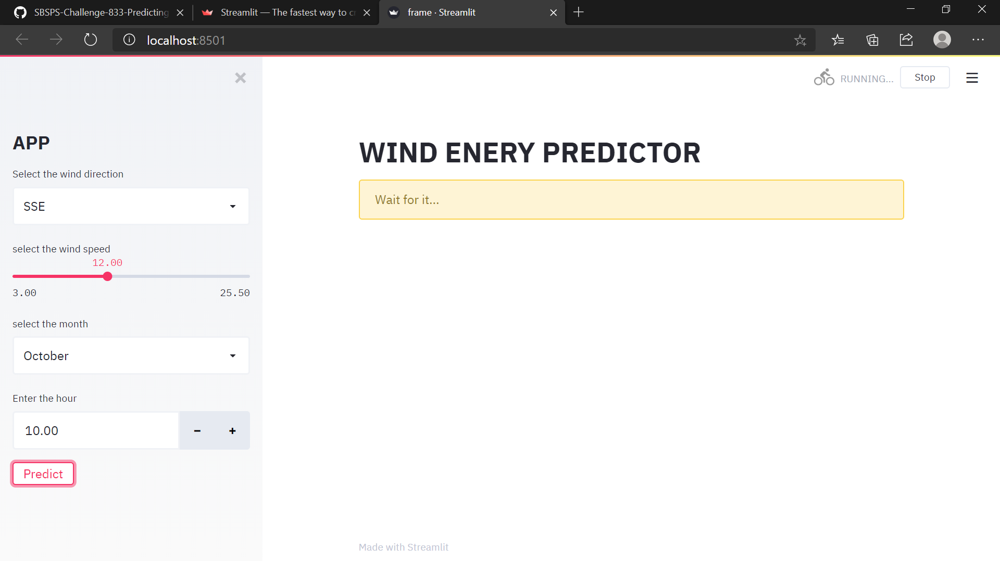
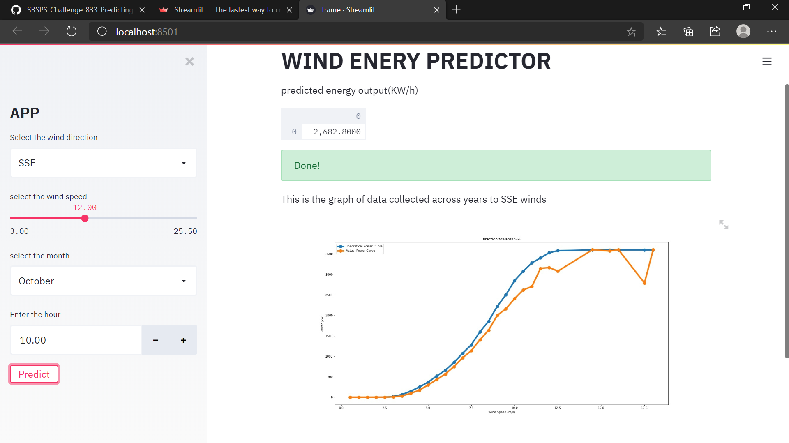

# Predicting the energy output of wind turbine based on weather condition
---


This project provides a simple web ui to predict power output of wind turbine based on various condition!.
User need to be specify wind speed and direction and some other aspects in the web ui to get the predictions!!
It additionally provides some graph of wind direction vs powes output(trained using yearly data)


### Technology used
1. Python(3.7 or above)

2. Streamlit:-Streamlit’s open-source app framework is the easiest way for data scientists and machine learning engineers to create beautiful, performant apps in only a few hours!  All in pure Python. All for free.

3. Machine learning using python


Note:- the above used dataset is from kaggle!!


- after installing the minimum requirements open command prompt
- get into folder where u have copied the above repo
- And then enter 
          
   ``` streamlit run frame.py```
           
   To start the sever
 - it opens a localhost webpage where we can predict the things!!!
 
 
 --- 
 #### live screenshots of working web app
 
 1.
 
 ---
 2.
 
 --- 
 3.
 
 ---
 4.
 
 ---
 5.

